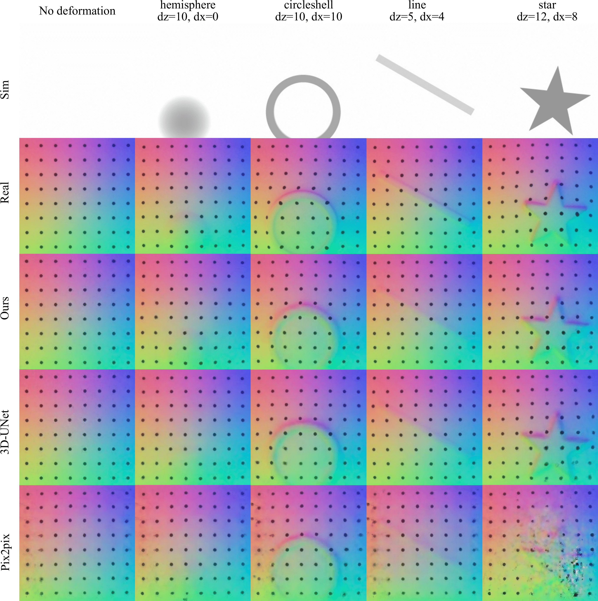
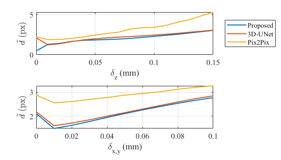

# Marker-Embedded Tactile Image Generation via Generative Adversarial Networks
We present a generative adversarial network(GAN)-based method for generating realistic marker-embedded tactile images in Gelsight-like vision-based tactile sensors.

## Data
All images collected in our work can be found under `data` folder.
The `data/raw` folder contains the raw tactile and simulated depth images and the `data/dataset` folder contains the cropped & resized tactile and depth images.

## Generating images with trained generator

## Evaluation
We have evaluated the quality of 

