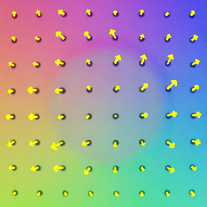
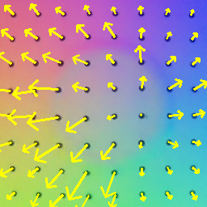
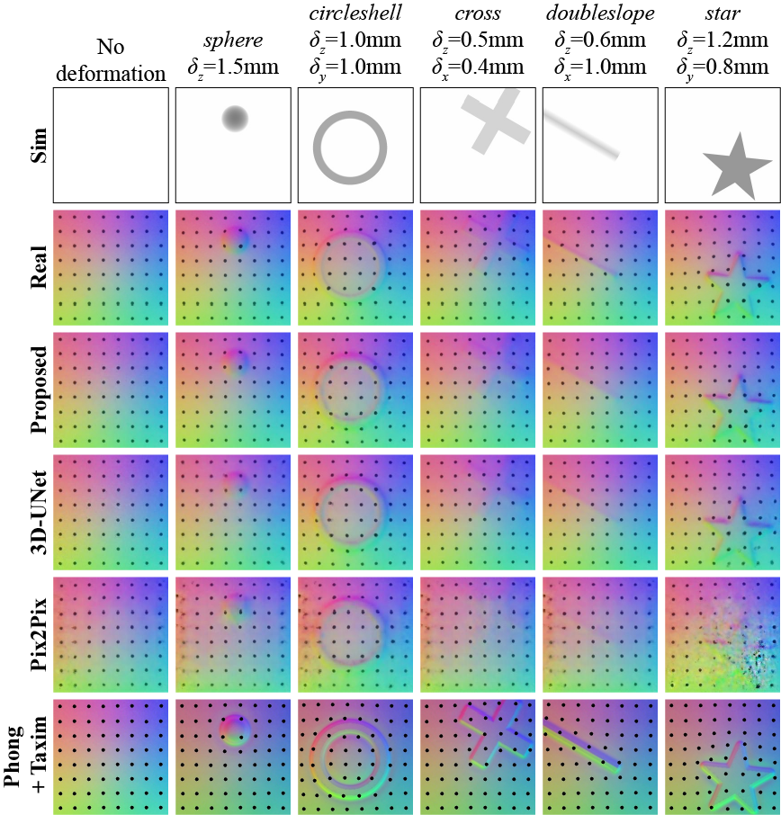

# Marker-Embedded Tactile Image Generation via Generative Adversarial Networks
We present a generative adversarial network(GAN)-based method for generating realistic marker-embedded tactile images in Gelsight-like vision-based tactile sensors.
The trained generator translates simulated depth image sequences to RGB marker-embedded tactile images.

For more information, please check the [paper](https://ieeexplore.ieee.org/document/10146407).

## Prerequisites
The project has been tested on Ubuntu 16.04 & 18.04 with Python 3.7.

Our project uses a physics simulator to obtain simulated depth images.
We use the MuJoCo simulator (version 2.1) with [mujoco-py](https://github.com/openai/mujoco-py) and require users to have it installed for using this project.

## Usage
You can choose to make contact with one of the 16 objects (listed below) using the `--object` (`-obj`) argument.

>'circleshell', 'cone', 'cross', 'cubehole', 'cuboid', 'cylinder', 'doubleslope', 'hemisphere', 'line', 'pacman', 'S', 'sphere', 'squareshell', 'star', 'tetrahedron', 'torus'

You can set the initial pose of the sensor with respect to the center of the target object with `--x_init`, `--y_init`, `--r_init` (`-x`, `-y`, `-r`) arguments.
The units of `-x`, `-y` are millimeter and the unit of `-r` is degree.  

You can control the amount of normal deformation with `--dz`, (`-dz`), and lateral deformations with `--dx`, `--dy` (`-dx`, `-dy`) arguments.
The units of `-dx`, `-dy`, and `-dz` are millimeter.
Note that we have limited the range of the deformations to [0, 1.5] for `-dz`, and [-1, 1] for `-dx`, `-dy`.

Run `python main.py -obj circleshell -dx 0.2 -dy 0.3 -dz 0.7` to visualize the generated tactile image.

## Examples
<p float="left">
  
   
  
</p>

The left image corresponds to depth image available from both `-obj circleshell -dz 0.5` and `-obj circleshell -x -1. -dx 1. -dz 0.5`.

The middle image is generated from `-obj circleshell -dz 0.5`.
The right image is generated from `-obj circleshell -x -1. -dx 1. -dz 0.5`.



These are examples of generated images using different methods.
Details on the performance of the methods are available in the paper. 

## Dataset
For access to the aligned real and simulated image dataset we used for training the GAN, contact us via e-mail (you can find the address in the paper).

## Citation
```
@ARTICLE{kim2023marker,
  author={Kim, Won Dong and Yang, Sanghoon and Kim, Woojong and Kim, Jeong-Jung and Kim, Chang-Hyun and Kim, Jung},
  journal={IEEE Robotics and Automation Letters}, 
  title={Marker-Embedded Tactile Image Generation via Generative Adversarial Networks}, 
  year={2023},
  volume={8},
  number={8},
  pages={4481-4488},
  doi={10.1109/LRA.2023.3284370}}
```
